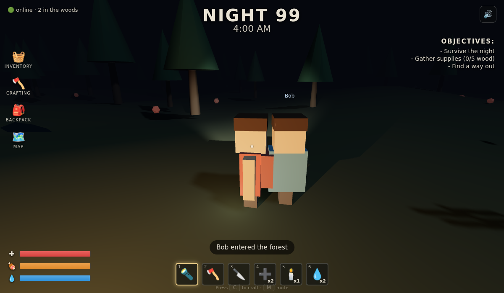

# Nightfall Woods

A blocky, Roblox-style forest survival game that runs in any browser. No engine
install, no build step, no account. You wake on **Night 99** at 4:00 AM in a dark
forest and have to reach dawn without your health, hunger, or thirst hitting zero,
while something with antlers moves between the trees.

Built with plain [Three.js](https://threejs.org) (vendored locally, so it works
fully offline). Now with **procedural sound, crafting, an endless difficulty ramp
across nights, and optional multiplayer**.


## Play it

The game is a static site — three files and no server-side code. Any of these work:

**Option A — one command (recommended):**

```bash
cd nightfall-woods
python3 -m http.server 8000
# then open http://localhost:8000 in your browser
```

**Option B — Node:**

```bash
cd nightfall-woods
npx serve .          # or: npx http-server .
```

**Option C — just open the file:** double-click `index.html`. Three.js is
vendored as a classic script (`vendor/three.min.js`), so it loads straight from
`file://` in Chrome/Edge/Firefox with no internet connection.

## How to play

| Input | Action |
|-------|--------|
| **W A S D** | Move |
| **Mouse** | Look (click the game to lock the pointer) |
| **Shift** | Sprint |
| **Space** | Jump |
| **1–6** | Select hotbar item |
| **Left-click** | Use selected item |
| **F** | Toggle flashlight |
| **E** | Interact (pick up berries/water, board the boat) |
| **C** | Open/close crafting |
| **M** | Mute/unmute sound |
| **Esc** | Pause |

### The loop

- **Survive to 6:00 AM.** The clock ticks up from 4:00. Reach dawn and you win.
- **Watch three bars:** health (red), hunger (orange), thirst (blue). Hunger and
  thirst drain over time. When either empties, it starts eating your health.
- **Eat and drink.** Red berries in the woods restore hunger (walk up, press **E**).
  Blue water pools refill your water bottles; drink with hotbar slot **6**.
- **Feed the fire.** Chop trees with the **axe** (slot 2) to gather wood. Wood
  tops up the campfire, and standing in firelight keeps you warm, slowly heals
  you, and hides you from the creature.
- **The creature hunts in the dark.** It stalks the treeline and charges when it
  spots you away from the fire. Fend it off with the **knife** (slot 3) or wave a
  **torch** (slot 5) to stagger it. The campfire's light keeps it back.
- **Two ways to win:** escape by boat (gather 5 wood, press **E** at the boat), or
  keep surviving night after night for as long as you can.

### Surviving forever: the night ramp

Reaching 6:00 AM no longer ends the run. Dawn breaks, you get a small hunger/thirst
top-up, and **Night 100, 101, 102...** begin, each harder than the last:

- More creatures join the hunt (up to a full pack).
- They move faster, spot you from further away, and hit harder.
- Hunger and thirst drain quicker.

Your health carries over between nights, so every night is a fresh gamble on how
long to push before you make a run for the boat. Escaping by boat is the only clean
"win"; otherwise it's a high-score chase for the highest night you can reach.

### Crafting

Press **C** (or click the CRAFTING icon) to spend wood on supplies:

| Recipe | Cost | Effect |
|--------|------|--------|
| ➕ Bandage | 2 🪵 | +1 First Aid charge |
| 🕯️ Torch | 2 🪵 | +1 torch to stagger the creatures |
| 🔥 Fire Fuel | 1 🪵 | Refuel the campfire (+25) from anywhere |
| 🔱 Spear | 4 🪵 | Permanent: your knife hits harder with more reach |

### Sound

All audio is **synthesized at runtime with the Web Audio API** — there are no sound
files to download, and it works offline. You get a crackling campfire that grows as
you approach, footsteps, chopping, a low threat drone that swells when a creature
charges, a stinger the moment the chase begins, and win/lose stings. Toggle it with
**M** or the speaker button (top-right).

### Multiplayer (optional)

Play the same woods with friends. It's entirely opt-in — the game is fully
single-player if you skip it.

1. Start the relay server:
   ```bash
   cd nightfall-woods/server
   npm install
   npm start            # listens on ws://localhost:8080
   ```
2. On the start screen, tick **Play multiplayer**, enter your name, and point it at
   the server (`ws://localhost:8080` for the same machine, or your host's LAN/public
   address for remote play).
3. Everyone connected sees each other as named avatars moving through the forest.



The server is a tiny relay (`server/server.js`, ~70 lines): it assigns ids and
broadcasts position/rotation. The forest and creatures stay client-side, so it's a
shared-space "see each other" layer, a clean base to grow toward synced enemies and
shared objectives.

### Hotbar

| Slot | Item | Use |
|------|------|-----|
| 1 | 🔦 Flashlight | Toggle your light (also **F**) |
| 2 | 🪓 Axe | Chop the nearest tree for wood |
| 3 | 🔪 Knife | Strike the creature up close |
| 4 | ➕ First Aid | Heal +40 HP (2 uses) |
| 5 | 🕯️ Torch | Stagger the creature |
| 6 | 💧 Water | Drink to restore thirst |

## Project layout

```
nightfall-woods/
├── index.html          # HUD, menus, crafting/multiplayer UI, page shell
├── game.js             # All game logic (world, player, creatures, systems)
├── audio.js            # Procedural Web Audio sound (window.SFX)
├── net.js              # Multiplayer client (window.Net)
├── server/
│   ├── server.js       # WebSocket relay server
│   └── package.json    # Server deps (ws)
├── vendor/
│   └── three.min.js    # Three.js r128 (vendored for offline play)
└── README.md
```

`game.js` is vanilla JS — world generation, the blocky avatar, creature AI,
day/night cycle, survival stats, crafting, the night ramp, and win/lose flow, all in
one readable file. Sound (`audio.js`) and networking (`net.js`) are decoupled modules
exposed as `window.SFX` / `window.Net`.

## Ideas to extend

- Server-authoritative creatures so the whole pack is shared in multiplayer.
- Shared objectives and reviving downed teammates.
- A visible map behind the MAP icon.
- Weather and seasonal variation across nights.

## Credits

Made as a from-scratch survival prototype in the style of *99 Nights in the Forest*.
Three.js is MIT-licensed (see `vendor/three.min.js` header).
