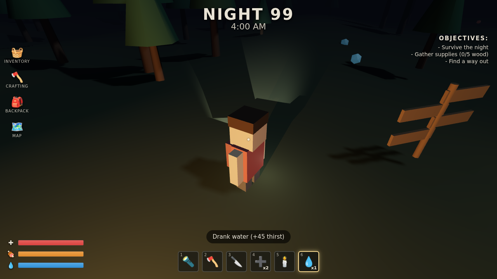

# Nightfall Woods

A blocky, Roblox-style forest survival game that runs in any browser. No engine
install, no build step, no account. You wake on **Night 99** at 4:00 AM in a dark
forest and have to reach dawn without your health, hunger, or thirst hitting zero,
while something with antlers moves between the trees.

Built with plain [Three.js](https://threejs.org) (vendored locally, so it works
fully offline).



## Play it

The game is a static site — three files and no server-side code. Any of these work:

**Option A — one command (recommended):**

```bash
cd nightfall-woods
python3 -m http.server 8000
# then open http://localhost:8000 in your browser
```

**Option B — Node:**

```bash
cd nightfall-woods
npx serve .          # or: npx http-server .
```

**Option C — just open the file:** double-click `index.html`. Three.js is
vendored as a classic script (`vendor/three.min.js`), so it loads straight from
`file://` in Chrome/Edge/Firefox with no internet connection.

## How to play

| Input | Action |
|-------|--------|
| **W A S D** | Move |
| **Mouse** | Look (click the game to lock the pointer) |
| **Shift** | Sprint |
| **Space** | Jump |
| **1–6** | Select hotbar item |
| **Left-click** | Use selected item |
| **F** | Toggle flashlight |
| **E** | Interact (pick up berries/water, board the boat) |
| **Esc** | Pause |

### The loop

- **Survive to 6:00 AM.** The clock ticks up from 4:00. Reach dawn and you win.
- **Watch three bars:** health (red), hunger (orange), thirst (blue). Hunger and
  thirst drain over time. When either empties, it starts eating your health.
- **Eat and drink.** Red berries in the woods restore hunger (walk up, press **E**).
  Blue water pools refill your water bottles; drink with hotbar slot **6**.
- **Feed the fire.** Chop trees with the **axe** (slot 2) to gather wood. Wood
  tops up the campfire, and standing in firelight keeps you warm, slowly heals
  you, and hides you from the creature.
- **The creature hunts in the dark.** It stalks the treeline and charges when it
  spots you away from the fire. Fend it off with the **knife** (slot 3) or wave a
  **torch** (slot 5) to stagger it. The campfire's light keeps it back.
- **Two ways to win:** outlast the night until dawn, *or* gather 5 wood and press
  **E** at the boat on the lake to lever it free and escape.

### Hotbar

| Slot | Item | Use |
|------|------|-----|
| 1 | 🔦 Flashlight | Toggle your light (also **F**) |
| 2 | 🪓 Axe | Chop the nearest tree for wood |
| 3 | 🔪 Knife | Strike the creature up close |
| 4 | ➕ First Aid | Heal +40 HP (2 uses) |
| 5 | 🕯️ Torch | Stagger the creature |
| 6 | 💧 Water | Drink to restore thirst |

## Project layout

```
nightfall-woods/
├── index.html          # HUD, menus, and page shell
├── game.js             # All game logic (world, player, creature, systems)
├── vendor/
│   └── three.min.js    # Three.js r128 (vendored for offline play)
└── README.md
```

Everything is vanilla JS in `game.js` — world generation, the blocky avatar, the
creature AI, day/night cycle, survival stats, and the win/lose flow are all in one
readable file, easy to fork and extend.

## Ideas to extend

- More creatures and a difficulty ramp across nights.
- A crafting menu behind the CRAFTING icon (bandages, torches from wood).
- Real multiplayer with a small WebSocket server (this is where a "Roblox-like"
  version would grow next).
- Sound: a crackling fire loop, footsteps, and a stinger when the creature charges.

## Credits

Made as a from-scratch survival prototype in the style of *99 Nights in the Forest*.
Three.js is MIT-licensed (see `vendor/three.min.js` header).
